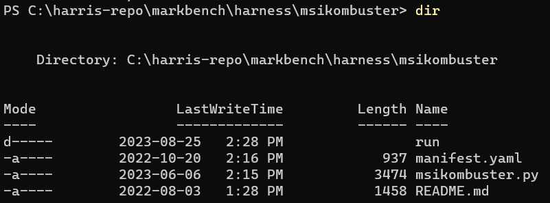

<h1>MarkBench Test Harnesses</h1>

<!-- omit in toc -->
## About The Project
Welcome to the official MarkBench testing platform developed by the LTT Labs team. MarkBench serves as the orchestration and data collection framework, while the tests themselves form the core of this process. The tests featured in this repository are actively employed to generate the data showcased in LTT (Linus Tech Tips) videos. We've made the code available here, allowing anyone to execute the very same tests that we use. It's worth noting that you do not require MarkBench to execute the tests provided within this project.

### Project versions
The versions of tests that are available here are taken from snapshots of our private working repository where we maintain and update existing tests as well as develop and add new tests. We are making the effort to provide new versions of our code to the public at least once a quarter (i.e. every three months). However, we may occasionally release versions more often than this, should we have changes that we feel are worth sharing sooner rather than later. Depending on the changes we have made during the time between release versions, the differences in versions may vary in the amount and significance of changes made.


<!-- omit in toc -->
## Table of Contents
- [Getting Started](#getting-started)
- [A test and its harness](#a-test-and-its-harness)
  - [Harness Manifest](#harness-manifest)
  - [JSON Report](#json-report)
- [Creating a test harness](#creating-a-test-harness)
- [Tools in the toolbox](#tools-in-the-toolbox)
  - [Keras OCR](#keras-ocr)
  - [Keyboard and Mouse Input](#keyboard-and-mouse-input)
- [License](#license)

## Getting Started
Configuring your system to execute these tests is straightforward; you'll only need Python, Poetry, and git. However, it's important to note that some of the tests in this repository may necessitate additional services or specific applications to be installed. For instance, if you intend to run the game tests, you will need to possess a valid copy of the respective game title.

<!-- omit in toc -->
### Prerequisites

<!-- omit in toc -->
#### Python 3.10+
Most of the test harnesses are written in Python, which you will need on your system. We use Python 3.11 on our test benches, but should work on versions since 3.10.

<!-- omit in toc -->
##### Installation
We recommend you install python from the [official downloads page](https://www.python.org/downloads/) and not the Windows Store.

<!-- omit in toc -->
#### Poetry
This project uses [Poetry](https://python-poetry.org/docs/) for dependency management.

<!-- omit in toc -->
##### Installation
Open a powershell terminal and execute the following command to download and execute the install script.
```powershell
(Invoke-WebRequest -Uri https://install.python-poetry.org -UseBasicParsing).Content | py -
```
After installation you will want to add poetry to the path. On Windows this path to add is `%APPDATA%\Python\Scripts`. Test that poetry is working by executing `poetry --version`, a version number should be returned, not an error.

<!-- omit in toc -->
##### Downloading dependencies
1. Open a terminal in the root directory.
2. Execute `poetry install`

Poetry installs dependencies into virtual environments. You can read more about [managing poetry environments here.](https://python-poetry.org/docs/managing-environments/).

<p align="right">(<a href="#readme-top">back to top</a>)</p>

<!-- omit in toc -->
### Running your first test
Once you've successfully installed Python and Poetry, it's time to kick off our initial test. We'll begin by launching MSI Kombustor, which serves as our primary choice for testing and exploring new MarkBench functionalities. MSI Kombustor provides an excellent starting point for acquainting yourself with our test harnesses, as it doesn't necessitate any additional automation tools from our toolkit.

Let's take a look at the folder structure

- msikombustor (dir)
  - run (dir)
  - manifest.yaml
  - msikombustor.py
  - README.md

When we mention "test harness," we are specifically referring to the entire directory and its contents. Within this directory, we anticipate, at the very least, the presence of an executable file that follows the guideline of returning either 1 or 0 to signify the completion status. Additionally, the manifest.yaml serves as metadata that allows MarkBench to identify it; however, for now, we can disregard it.

The run directory, on the other hand, is the designated location for all outputs, including log files or screenshots. While it's not an absolute requirement, it has been the prevailing convention thus far.

1. First [install MSI Kombustor](https://geeks3d.com/furmark/kombustor/) using the default install location and options.

2. Second open a Powershell terminal and navigate to the root of the msikombustor directory.



3. From this directory run the command
```powershell
python .\msikombustor.py --test vkfurrytorus --resolution "1080,1920" -b true
```

Executing this command initiates MSI Kombustor in benchmark mode, specifically launching the (VK) FurMark-Donut test at a resolution of 1920 x 1080. After the benchmark run concludes, you'll find the log and any captured assets stored within the **msikombustor/run** directory.

It's important to note that the arguments required for each harness may vary. To ensure smooth test execution, consult the README of each harness, which provides detailed instructions on any unique requirements for running that specific test.

<p align="right">(<a href="#readme-top">back to top</a>)</p>

## A test and its harness
MarkBench has the capability to accommodate any test that can be carried out on a Windows system and concludes with a success code of 0 or a failure code of 1. For MarkBench to recognize a test harness as automatable, it must include a manifest.yaml file containing essential metadata about the harness.

The test harness is responsible for:
1. Setup
2. Execution
3. Gathering of assets
4. Cleanup

### Harness Manifest
In MarkBench, the manifest.yaml file serves as a configuration file containing metadata about a test, providing essential information for MarkBench to execute the test correctly.

Example
```yaml
friendly_name: "Blender Benchmark"
executable: "blender.py"
process_name: "blender.exe"
disable_presentmon: true
hidden: 0
output_dir: "run"
options:
  - name: scene
    type: select
    values: [all, classroom, junkshop, monster]
  - name: version
    type: select
    values: ["3.6.0", "3.5.0", "3.4.0", "3.3.0"]
  - name: device
    type: select
    values: ["CPU", "GPU"]
```

<p align="right">(<a href="#readme-top">back to top</a>)</p>

### JSON Report
Every harness (optionally) will write out some results in JSON format to a file called report.json. The JSON contents are read and stored in the database by MarkBench.

<!-- omit in toc -->
#### Non Game Report
Any test that isn't a game *should* include a report for MarkBench to upload to the database. This report if present requires a value for the following properties:
- **test** string - indicates any subparameters. For example BlenderBenchmark has the tests (scenes) classroom, junkshop, and monster.
- **version** string - applicable version of the test or program under test. This property is optional if no version is available.
- **score** string - a scalar output from the test. This could be a benchmark score, or duration.
- **unit** string - the unit of measurement of the scalar. If duration, this could be seconds or minutes. If the score is simply a score, than this property can be omitted or left empty.
- **label** string - optional friendly name for the unit of measurement. For example "fps" vs "Frames Per Second". This property is mainly used to override an axis on a graph downstream.

The JSON report can be a single object, or array of reports, indicating to MarkBench there is more than one result to record.
```json
{
  "test": "FireStrike",
  "version": "4.5.1",
  "score": "16099",
  "unit": "",
  "label": "",
  "start_time": 1702514174861,
  "end_time": 1702514209166
}
```

<!-- omit in toc -->
#### Game Report
Game reports don't require a report as the score is the FPS which is calculated downstream of MarkBench. It is helpful if the report does include things such as resolution, start time, and end time.
```json
{
  "resolution": "1920x1080",
  "start_time": 1702514174861,
  "end_time": 1702514209166
}
```
> Note, start_time and end_time given in the report.json of a game test will be used as the markers of when to start measuring FPS and when to stop.

<p align="right">(<a href="#readme-top">back to top</a>)</p>

## Creating a test harness
Let's create a harness for the test FurMark.

```python
import os.path
import sys

DEFAULT_FURMARK_DIR = "C:\\Program Files (x86)\\Geeks3D\\Benchmarks\\FurMark"
EXECUTABLE = "FurMark.exe"
ABS_EXECUTABLE_PATH = os.path.join(DEFAULT_FURMARK_DIR, EXECUTABLE)

if os.path.isfile(ABS_EXECUTABLE_PATH) is False:
    raise ValueError('No FurMark installation detected! Default installation expected to be present on the system.')

# omit the first arg which is the script name
args = sys.argv[1:]
command = f'"{ABS_EXECUTABLE_PATH}" '
for arg in args:
    command += arg + ' '

command = command.rstrip()
os.system(command)
```
This is a very simple harness which takes in the arguments passed from the commandline and then executes the `FurMark.exe` test. A test harness can vary wildly in complexity depending on the test the harness is implementing. A canned game benchmark might require use of libraries like PyAutoGui to navigate around a game menu, or edit registry to setup configuration.

Harness entry points and any supporting files should live in a named directory in the root harness directory.

<p align="right">(<a href="#readme-top">back to top</a>)</p>

## Tools in the toolbox

### Keras OCR

We employ a deployment of [Keras OCR](https://github.com/faustomorales/keras-ocr) integrated into an HTTP API to assist in navigating game menus. This service accepts an image and a designated target word, and in return, it provides the coordinates of the word's location within the image. If the word cannot be located, it returns a "false" response.

For detailed instructions on setting up this Keras Service locally, please refer to our [Keras Service repository linked here](https://github.com/LTTLabsOSS/keras-ocr-service).

> Please note that although a CUDA-capable GPU is not mandatory, it's worth mentioning that certain games may not function correctly due to slower response times when this hardware is absent.

If Keras is taking images on the wrong monitor, the primary display can be modified by changing `monitor_1 = sct.monitors[2]  # Identify the display to capture` in `keras_service.py`

### Keyboard and Mouse Input

For keyboard and mouse input, we employ two distinct methods. The first method involves using Virtual Key Codes (VKs) with the deprecated Win32 functions mouse_event() and keybd_event(). The second method utilizes Send Input. Specifically, [PyAutoGui](https://pyautogui.readthedocs.io/en/latest/) implements the first approach, while [PyDirectInput](https://pypi.org/project/PyDirectInput/) implements the second.

### Gamepad Input

For gamepad input, we utilize [Vgamepad](https://pypi.org/project/vgamepad/) in order to navigate some stubborn menus or games with scaling issues.

<p align="right">(<a href="#readme-top">back to top</a>)</p>

## License

Distributed under the GNU GENERAL PUBLIC LICENSE Version 3. See `LICENSE` for more information.

<p align="right">(<a href="#readme-top">back to top</a>)</p>