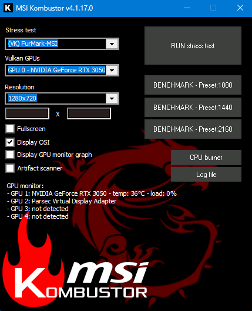

# MSI Kombustor harness
This is a wrapper for the [MSI Kombustor](https://geeks3d.com/furmark/kombustor/) application.

>MSI Kombustor is MSI's exclusive burn-in benchmarking tool based on the well-known FurMark software. This program is specifically designed to push your graphics card to the limits to test stability and thermal performance. Kombustor supports cutting edge 3D APIs such as OpenGL or Vulkan. 

This harness takes in the **Test** and **Resolution** as command line arguments and then executes. If started in benchmark mode the score will be recorded. If not in Benchmark mode MSI Kombustor will run until manually exited.

The test script utilizes the `-width`, `-height`, `-benchmark`, `-<test_name>` and `-logfile_in_app_folder` cli options. See the `msi-kombustor-technical-guide.pdf` included with the MSI Kombustor installation for a full list of supported options.

## Prerequisites

- Python 3.10+
- MSI Kombustor installed in default location.

## Output

report.json
- `resolution`: resolution used for the run.
- `test`: the test used for the run.
- `score`: score given from a benchmark run.